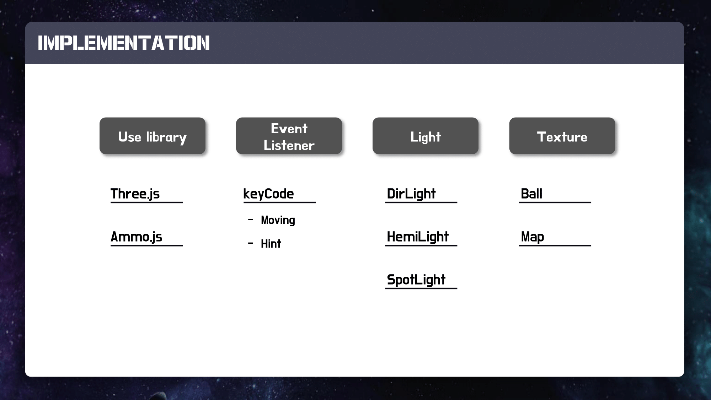

# CG_Traball
Gachon University's Department of Software 2020-2 Computer Graphics  Class Project: Jinkyung Kim, Seulyi Lee, Siyeon Cho

- Jinkyung Kim :lx97@kakao.com
- Seulyi Lee : liseuli713@gmail.com
- Siyeon Cho : chosiyeonn@gmail.com

# Brief Description
This game is that the ball escapes the maze by moving the board using a keyboard.
When using the keyboard to move the board, you must hold it down, not just press it once.

The hint is that when you press the Enter button, you'll see the whole maze. The number of hints used is three and the remaining hint number of times can be known through the star at the bottom.

# Key Features
1. From the perspective of looking down at the maze, We thought the difficulty to be too easy because players could see the whole maze. So, the difficulty level was increased by preventing the appearance of the maze.

2. Instead of using a keyboard to move the ball, the board under the ball (i.e., a maze) was moved so that the ball was moved by the tilt of the board.

3. Increase tension by limiting time and number of hints used.

# Implementation
* Using Three.js and Ammo.js
* Using EventListener for maze moving and hint
* Using various light : DirLight, HemiLight, SpotLight
* Mapping Texture : Ball, Map

# Final Presentation

